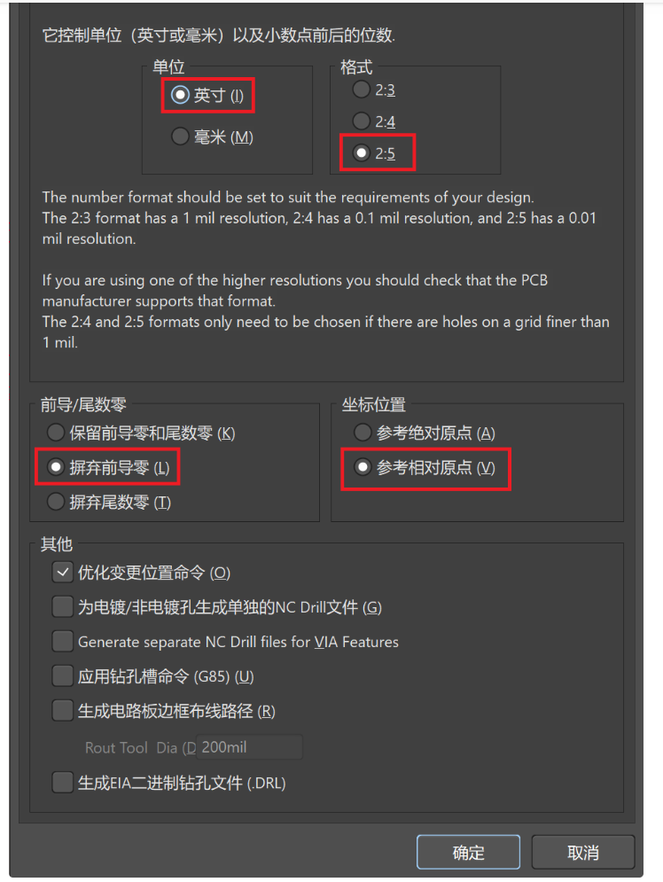

# 说明
1. InductSense-v0为早期版本，用于测量吉村折纸单元的三个折纸夹角，为STM32G0+LDC1614方案，仅支持有线输出。
2. imss-module为后续版本，MCU替换为STM32WB系列芯片，支持蓝牙数据通信和有线传输，但延迟较大（软件有待优化）。
3. 每个工程中都有相应线圈FPC的设计文档，名称中含有“fpc”字样，可供参考。

# FPC设计要点
1. 注意弯折角度较大的区域尽量不要走线，否则在此区域容易折断
2. 设计多层线圈时，注意电流在线圈中的流向要始终保持一个方向
3. 推荐TI的设计工具来确定线圈的线宽、线间距、层数和铜厚以及尺寸：[TI Coil Desgin](https://webench.ti.com/wb5/LDC/#/spirals)

# PCB加工指南——导出Gerber文件

**Gerber文件是提供给PCB加工厂（如嘉立创）的制造文件，具体导出指南如下**

1.制造输出-Gerber File： 单位-英寸，精度-2:4，使用到的层，输出使用过的钻孔层，高级-规格加大

2.制造输出-NC Drill File： 英寸，2:4

3.装配输出-Pick and Place File：默认

4.制造输出-Test Point File：IPC

另一个方法：`

[https://www.iotword.com/9426.html](https://www.iotword.com/9426.html)

1. 制造输出-Gerber File： 单位-英寸，精度-2:4，使用到的制造层，包括未连接焊盘，不勾选钻孔层，高级-默认
2. 制造输出-Gerber File： 单位-英寸，精度-2:4，不勾选制造层和包括未连接焊盘，勾选使用到的钻孔层，高级-默认
3. 制造输出-NC Drilling File:英寸，2:4

**最后将所有导出文件（工程目录下OUPUT文件夹中的所有文件）打包成zip，即可发给厂商加工**
